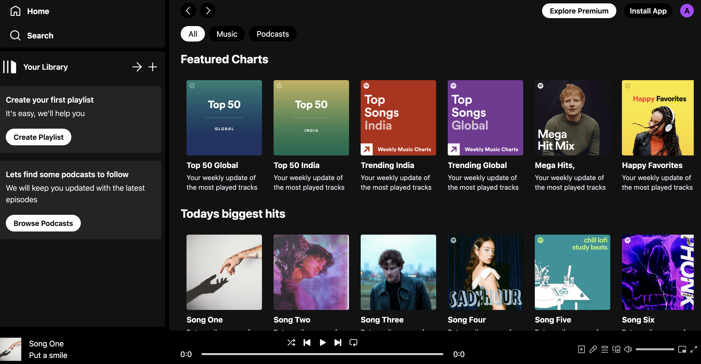

# Spotify Clone

This project is a Spotify-inspired music streaming web application built with React and Vite. It features a modern user interface, responsive design, and basic music player functionality. Users can browse albums, play songs, and explore a layout similar to the original Spotify app.



## Live Demo

You can try the deployed app here: [spotifyclonemikhail.netlify.app](https://spotifyclonemikhail.netlify.app/)

## Deployment

The project was deployed using [Netlify](https://www.netlify.com/). Simply connect your repository and follow the Netlify deployment instructions to get your own version online.

## Features

- Responsive and modern UI
- Sidebar navigation and top navbar
- Album and song display
- Audio player controls (play, pause, next, previous)
- Smooth navigation using React Router

## Technologies Used

- React
- Vite
- Tailwind CSS
- JavaScript

## Getting Started

1. Clone the repository:
	```
	git clone https://github.com/Askeran17/spotify-clone.git
	```
2. Install dependencies:
	```
	npm install
	```
3. Start the development server:
	```
	npm run dev
	```

## License

This project is for educational purposes only and is not affiliated with Spotify.
